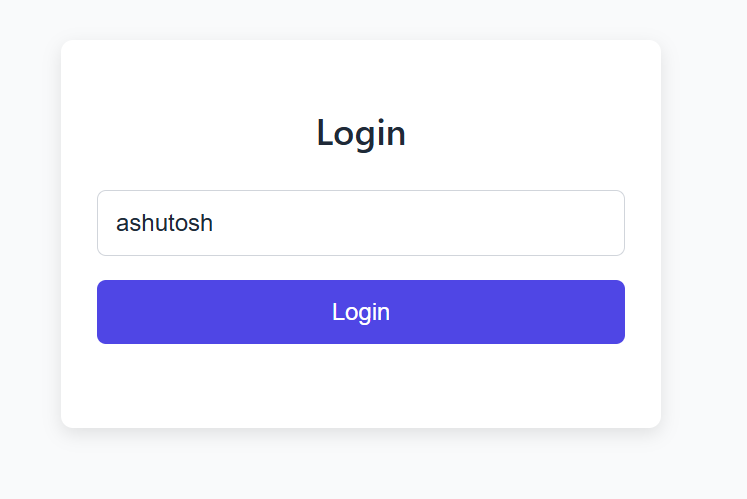
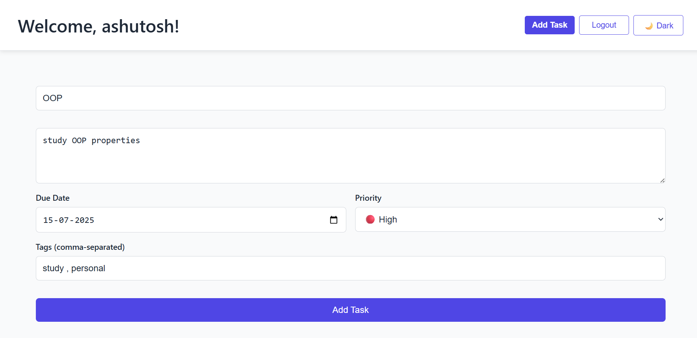
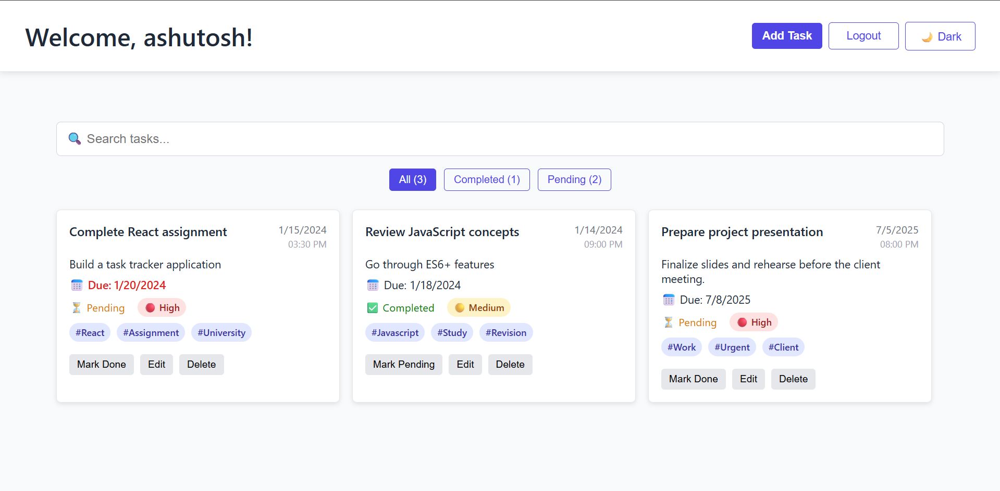

# Personal Task Tracker

## 📖 Description

Personal Task Tracker is a simple React-based web app for managing daily tasks efficiently. It features a minimal login
with username persistence, full task CRUD (Create, Read, Update, Delete) operations, task filtering, and data
persistence using `localStorage`. The app is designed to be responsive and user-friendly.

## 🚀 Features

- Basic login with username saved in `localStorage`
- Add new tasks with required title and optional description
- Edit tasks inline or via modal
- Delete tasks with confirmation prompt
- Toggle tasks between completed and pending states
- Display task creation date/time and visual distinction for status
- Filter tasks by All, Completed, and Pending, with task counts
- Persist tasks and login state in `localStorage`
- Bonus features:
    - Search Functionality
    - Task priority levels (low, medium, high)
    - Due dates and tags/categories for tasks
    - Smooth animation & Dark mode toggle

## 🛠 Setup Instructions

1. Clone the repository:
   ```bash
   git clone https://github.com/bravo1goingdark/Personal-Task-Tracker.git
2. Navigate to the project directory:
   ```bash
    cd Personal-Task-Tracker
3. Install dependencies:
   ```bash
    npm install
4. Run the app locally:
   ```bash
   npm run dev
5. Open http://localhost:5173/Personal-Task-Tracker/ in your browser.


## 🧰 Technologies Used
 - React.js (functional components and hooks)
 - React Router for routing
 - gh-pages for deploying on github
 - CSS for styling 
 - Browser localStorage API for persistence

## 🔗 Live Demo
 - Visit https://bravo1goingdark.github.io/Personal-Task-Tracker

## 📷 Screenshots

### Login Screen


### Add Task


### Task DashBoard

